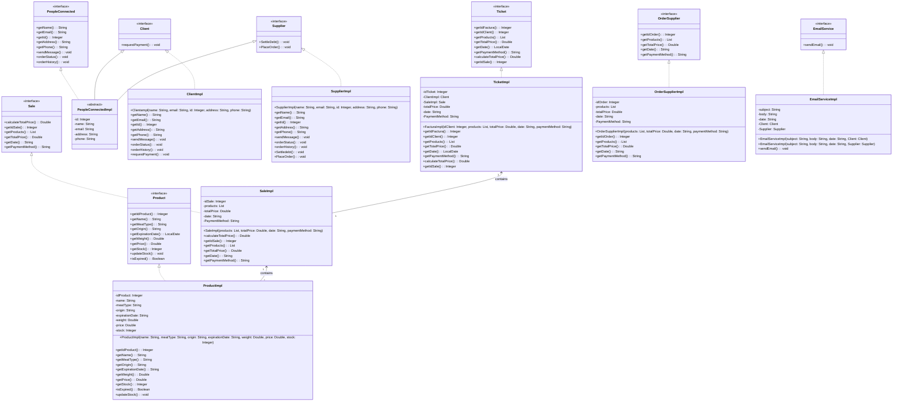

```mermaid
    classDiagram

    class Product {
        <<interface>>
        +getIdProduct(): Integer
        +getName(): String
        +getMeatType(): String
        +getOrigin(): String
        +getExpirationDate(): LocalDate
        +getWeight(): Double
        +getPrice(): Double
        +getStock(): Integer
        +updateStock(): void
        +isExpired(): Boolean
    }

    class ProductImpl {
        -idProduct: Integer
        -name: String
        -meatType: String
        -origin: String
        -expirationDate: String
        -weight: Double
        -price: Double
        -stock: Integer
        +ProductImpl(name: String, meatType: String, origin: String, expirationDate: String, weight: Double, price: Double, stock: Integer)
        +getIdProduct(): Integer
        +getName(): String
        +getMeatType(): String
        +getOrigin(): String
        +getExpirationDate(): String
        +getWeight(): Double
        +getPrice(): Double
        +getStock(): Integer
        +isExpired(): Boolean
        +updateStock(): void
    }

    class Sale {
        <<interface>>
        +calculateTotalPrice(): Double
        +getIdSale(): Integer
        +getProducts(): List<Product>
        +getTotalPrice(): Double
        +getDate(): String
        +getPaymentMethod(): String
    }

    class SaleImpl {
        -idSale: Integer
        -products: List<Product>
        -totalPrice: Double
        -date: String
        -PaymentMethod: String
        +SaleImpl(products: List<Product>, totalPrice: Double, date: String, paymentMethod: String)
        +calculateTotalPrice(): Double
        +getIdSale(): Integer
        +getProducts(): List<Product>
        +getTotalPrice(): Double
        +getDate(): String
        +getPaymentMethod(): String
    }

    class PeopleConnected {
        <<interface>>
        +getName(): String
        +getEmail(): String
        +getId(): Integer
        +getAddress(): String
        +getPhone(): String
        +sendMessage(): void
        +orderStatus(): void
        +orderHistory(): void
    }

    class PeopleConnectedImpl {
        <<abstract>>
        -id: Integer
        -name: String
        -email: String
        -address: String
        -phone: String
    }

    class Client {
        <<interface>>
        +requestPayment(): void
    }

    class ClientImpl {
        +Clientempl(name: String, email: String, id: Integer, address: String, phone: String)
        +getName(): String
        +getEmail(): String
        +getId(): Integer
        +getAddress(): String
        +getPhone(): String
        +sendMessage(): void
        +orderStatus(): void
        +orderHistory(): void
        +requestPayment(): void
    }

    class Supplier {
        <<interface>>
        +SettleDebt(): void
        +PlaceOrder(): void
    }

    class SupplierImpl {
        +SupplierImpl(name: String, email: String, id: Integer, address: String, phone: String)
        +getName(): String
        +getEmail(): String
        +getId(): Integer
        +getAddress(): String
        +getPhone(): String
        +sendMessage(): void
        +orderStatus(): void
        +orderHistory(): void
        +Settledebt(): void
        +PlaceOrder(): void
    }

    class Ticket {
        <<interface>>
        +getIdFactura(): Integer
        +getIdClient(): Integer
        +getProducts(): List<Product>
        +getTotalPrice(): Double
        +getDate(): LocalDate
        +getPaymentMethod(): String
        +calculateTotalPrice(): Double
        +getIdSale(): Integer
    }

    class TicketImpl {
        -idTicket: Integer
        -ClientImpl: Client
        -SaleImpl: Sale
        -totalPrice: Double
        -date: String
        -PaymentMethod: String
        +FacturaImpl(idClient: Integer, products: List<Product>, totalPrice: Double, date: String, paymentMethod: String)
        +getIdFactura(): Integer
        +getIdClient(): Integer
        +getProducts(): List<Product>
        +getTotalPrice(): Double
        +getDate(): LocalDate
        +getPaymentMethod(): String
        +calculateTotalPrice(): Double
        +getIdSale(): Integer
    }

    class OrderSupplier {
        <<interface>>
        +getIdOrder(): Integer
        +getProducts(): List<Product>
        +getTotalPrice(): Double
        +getDate(): String
        +getPaymentMethod(): String
    }

    class OrderSupplierImpl {
        -idOrder: Integer
        -products: List<Product>
        -totalPrice: Double
        -date: String
        -PaymentMethod: String
        +OrderSupplierImpl(products: List<Product>, totalPrice: Double, date: String, paymentMethod: String)
        +getIdOrder(): Integer
        +getProducts(): List<Product>
        +getTotalPrice(): Double
        +getDate(): String
        +getPaymentMethod(): String
    }

    class EmailService {
        <<interface>>
        +sendEmail(): void
    }

    class EmailServiceImpl {
        -subject: String
        -body: String
        -date: String
        -Client: Client
        -Supplier: Supplier
        +EmailServiceImpl(subject: String, body: String, date: String, Client: Client)
        +EmailServiceImpl(subject: String, body: String, date: String, Supplier: Supplier)
        +sendEmail(): void
    }

    Product <|.. ProductImpl
    Sale <|.. SaleImpl
    PeopleConnected <|.. PeopleConnectedImpl
    Client <|-- PeopleConnectedImpl
    Client <|.. ClientImpl
    Supplier <|-- PeopleConnectedImpl
    Supplier <|.. SupplierImpl
    Ticket <|.. TicketImpl
    OrderSupplier <|.. OrderSupplierImpl
    EmailService <|.. EmailServiceImpl

    SaleImpl  "1" <-- "*" ProductImpl : contains
    TicketImpl  "1" <-- "1" SaleImpl : contains
    
```