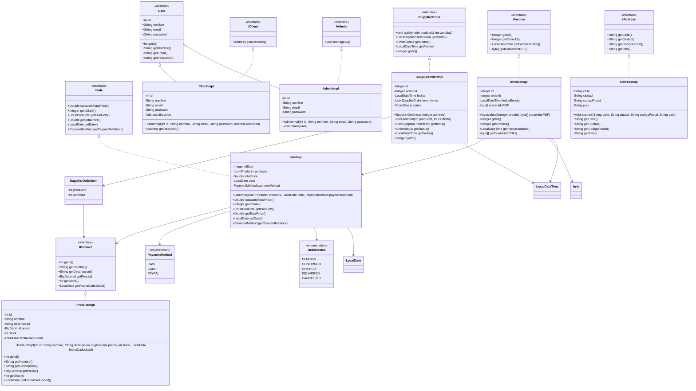

```mermaid
    classDiagram
    %% Abstract Base Class
    class User {
        <<abstract>>
        +int id
        +String nombre
        +String email
        +String password
        +int getId()
        +String getNombre()
        +String getEmail()
        +String getPassword()
    }

    %% Interfaces
    class IClient {
        <<interface>>
        +Address getDireccion()
    }
    class IAdmin {
        <<interface>>
        +void manageAll()
    }
    class IProduct {
        <<interface>>
        +int getId()
        +String getNombre()
        +String getDescripcion()
        +BigDecimal getPrecio()
        +int getStock()
        +LocalDate getFechaCaducidad()
    }
    class ISale {
        <<interface>>
        +Double calculateTotalPrice()
        +Integer getIdSale()
        +List~IProduct~ getProducts()
        +Double getTotalPrice()
        +LocalDate getDate()
        +PaymentMethod getPaymentMethod()
    }
    class ISupplierOrder {
        <<interface>>
        +void addItem(int productId, int cantidad)
        +List~SupplierOrderItem~ getItems()
        +OrderStatus getStatus()
        +LocalDateTime getFecha()
        +Integer getId()
    }
    class IInvoice {
        <<interface>>
        +Integer getId()
        +Integer getOrderId()
        +LocalDateTime getFechaEmision()
        +byte[] getContenidoPDF()
    }
    class IAddress {
        <<interface>>
        +String getCalle()
        +String getCiudad()
        +String getCodigoPostal()
        +String getPais()
    }

    %% Implementations
    class ClientImpl {
        -int id
        -String nombre
        -String email
        -String password
        -Address direccion
        +ClientImpl(int id, String nombre, String email, String password, Address direccion)
        +Address getDireccion()
    }
    class AdminImpl {
        -int id
        -String nombre
        -String email
        -String password
        +AdminImpl(int id, String nombre, String email, String password)
        +void manageAll()
    }
    class ProductImpl {
        -int id
        -String nombre
        -String descripcion
        -BigDecimal precio
        -int stock
        -LocalDate fechaCaducidad
        +ProductImpl(int id, String nombre, String descripcion, BigDecimal precio, int stock, LocalDate fechaCaducidad)
        +int getId()
        +String getNombre()
        +String getDescripcion()
        +BigDecimal getPrecio()
        +int getStock()
        +LocalDate getFechaCaducidad()
    }
    class SaleImpl {
        -Integer idSale
        -List~IProduct~ products
        -Double totalPrice
        -LocalDate date
        -PaymentMethod paymentMethod
        +SaleImpl(List~IProduct~ products, LocalDate date, PaymentMethod paymentMethod)
        +Double calculateTotalPrice()
        +Integer getIdSale()
        +List~IProduct~ getProducts()
        +Double getTotalPrice()
        +LocalDate getDate()
        +PaymentMethod getPaymentMethod()
    }
    class SupplierOrderImpl {
        -Integer id
        -Integer adminId
        -LocalDateTime fecha
        -List~SupplierOrderItem~ items
        -OrderStatus status
        +SupplierOrderImpl(Integer adminId)
        +void addItem(int productId, int cantidad)
        +List~SupplierOrderItem~ getItems()
        +OrderStatus getStatus()
        +LocalDateTime getFecha()
        +Integer getId()
    }
    class InvoiceImpl {
        -Integer id
        -Integer orderId
        -LocalDateTime fechaEmision
        -byte[] contenidoPDF
        +InvoiceImpl(Integer orderId, byte[] contenidoPDF)
        +Integer getId()
        +Integer getOrderId()
        +LocalDateTime getFechaEmision()
        +byte[] getContenidoPDF()
    }
    class AddressImpl {
        -String calle
        -String ciudad
        -String codigoPostal
        -String pais
        +AddressImpl(String calle, String ciudad, String codigoPostal, String pais)
        +String getCalle()
        +String getCiudad()
        +String getCodigoPostal()
        +String getPais()
    }

    %% Model Class
    class SupplierOrderItem {
        +int productId
        +int cantidad
    }

    %% Enums
    class PaymentMethod {
        <<enumeration>>
        CASH
        CARD
        PAYPAL
    }
    class OrderStatus {
        <<enumeration>>
        PENDING
        CONFIRMED
        SHIPPED
        DELIVERED
        CANCELLED
    }

    %% Inheritances and Implementations
    User <|-- ClientImpl
    User <|-- AdminImpl
    IClient <|.. ClientImpl
    IAdmin <|.. AdminImpl
    IProduct <|.. ProductImpl
    ISale <|.. SaleImpl
    ISupplierOrder <|.. SupplierOrderImpl
    IInvoice <|.. InvoiceImpl
    IAddress <|.. AddressImpl

    %% Associations
    SaleImpl --> IProduct
    SaleImpl --> PaymentMethod
    SaleImpl --> OrderStatus
    SupplierOrderImpl --> SupplierOrderItem
    SupplierOrderItem --> IProduct
    InvoiceImpl --> SaleImpl
    InvoiceImpl --> byte
    SaleImpl --> LocalDate
    SupplierOrderImpl --> LocalDateTime
    InvoiceImpl --> LocalDateTime
```
