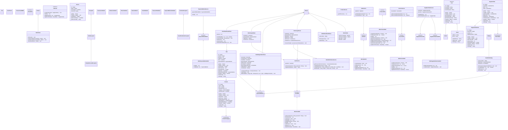

```mermaid
classDiagram
    class Test {
    }
    class MainFrame {
        - initPanels() : void
        - onClientLoginSuccess(client : Client) : void
        - onAdminLoginSuccess(admin : Admin) : void
        - showPanel(name : String) : void
    }
    class NewOrderDialog {
        - productsTable : JTable
        - tableModel : DefaultTableModel
        - cbPayment : JComboBox<PaymentMethod>
        - initComponents(paymentMethods : List<PaymentMethod>) : void
        + isCellEditable(r : int, c : int) : boolean
        - loadProducts() : void
        - onConfirm() : void
    }
    class ClientDashboardPanel {
        - salesList : List<Sale>
        + isCellEditable(r : int, c : int) : boolean
        + mouseClicked(e : MouseEvent) : void
        - showDatos() : void
        - showHistorial() : void
        - showOrderDetails(saleId : int) : void
    }
    class AdminLoginPanel {
        - emailField : JTextField
        - passwordField : JPasswordField
        - loginButton : JButton
        - userService : UserService
    }
    class ClientRegistrationPanel {
        - nameField : JTextField
        - surnameField : JTextField
        - emailField : JTextField
        - passwordField : JPasswordField
        - addressField : JTextField
        - phoneField : JTextField
        - paymentMethodCombo : JComboBox<PaymentMethod>
        - registerButton : JButton
        - cancelButton : JButton
        + componentShown(e : ComponentEvent) : void
        - clearFields() : void
        - addField(label : String, field : JComponent, row : int, gbc : GridBagConstraints) : void
    }
    class ClientLoginPanel {
        - emailField : JTextField
        - passwordField : JPasswordField
        - loginButton : JButton
        - registerLink : JLabel
        - userService : UserService
        - emailService : EmailNotificationService
        + mouseClicked(e : java.awt.event.MouseEvent) : void
    }
    class AdminDashboardPanel {
        - ordersTable : JTable
        - initComponents() : void
        - loadOrders() : void
    }
    class HomePanel {
        - clientAccessButton : JButton
        - adminAccessButton : JButton
        - logoLabel : JLabel
        - titleLabel : JLabel
    }
    class InvalidTextEnterException {
    }
    class EntityNotFoundException {
    }
    class DAOException {
    }
    class CatchTools {
    }
    class ConnectionDDBB {
    }
    class UserDAO {
        <<interface>>
    }
    class JdbcUserDAO {
        + authenticate(email : String, password : String) : User
        + findAllClients() : List<Client>
        + create(user : User) : User
        + findById(id : int) : User
        + findByEmail(email : String) : User
        + findAll() : List<User>
        + update(user : User) : User
        + delete(id : int) : void
        - mapRowToUser(rs : ResultSet) : User
    }
    class JdbcPaymentMethodDAO {
        + findAll() : List<PaymentMethod>
        + findById(id : int) : PaymentMethod
    }
    class PaymentMethodDAO {
        <<interface>>
    }
    class ClientDAO {
        <<interface>>
    }
    class JdbcProductDAO {
        + createProduct(product : Product) : void
        + findById(productId : int) : Product
        + findAll() : List<Product>
        + updateProduct(product : Product) : void
        + deleteProduct(productId : int) : void
        + findByCategory(category : ProductCategory) : List<Product>
        + findByNameContaining(term : String) : List<Product>
        + findLowStock(threshold : int) : List<Product>
        - mapRowToProduct(rs : ResultSet) : Product
    }
    class ProductDAO {
        <<interface>>
    }
    class JdbcSaleDAO {
        + createSale(sale : Sale) : void
        + findById(saleId : int) : Sale
        + findAll() : List<Sale>
        + findByClientId(clientId : int) : List<Sale>
        - mapRowToSale(rs : ResultSet) : Sale
    }
    class SaleDAO {
        <<interface>>
    }
    class JdbcInvoiceDAO {
        + createInvoice(invoice : Invoice) : void
        + findById(invoiceId : int) : Invoice
        + findByOrderId(orderId : int) : Invoice
        + findAll() : List<Invoice>
        + findByClientId(clientId : int) : List<Invoice>
        - mapRowToInvoice(rs : ResultSet) : Invoice
    }
    class InvoiceDAO {
        <<interface>>
    }
    class methods {
        <<interface>>
        + createOrder(order : SupplierOrder) : void
        + findAll() : List<SupplierOrder>
        + findById(orderId : int) : SupplierOrder
        - mapRowToOrder(rs : ResultSet) : SupplierOrder
    }
    class SupplierOrderDAO {
        <<interface>>
    }
    class SupplierOrderItemDAO {
        <<interface>>
    }
    class JdbcSupplierOrderItemDAO {
        + findByOrderId(orderId : int) : List<SupplierOrderItem>
        + createItem(item : SupplierOrderItem) : void
    }
    class Invoice {
        - id : Integer
        - saleId : Integer
        - invoiceDate : LocalDate
        - invoicePdf : byte[]
        + getId() : Integer
        + setId(id : Integer) : void
        + getSaleId() : Integer
        + getInvoiceDate() : LocalDate
        + getInvoicePdf() : byte[]
    }
    class OrderStatus {
        <<enumeration>>
    }
    class Sale {
        - id : Integer
        - clientId : Integer
        - products : List<Product>
        - totalPrice : Double
        - date : LocalDate
        - paymentMethod : PaymentMethod
        + getId() : Integer
        + setId(id : Integer) : void
        + getClientId() : Integer
        + getProducts() : List<Product>
        + getTotalPrice() : Double
        + getDate() : LocalDate
        + getPaymentMethod() : PaymentMethod
        + equals(o : Object) : boolean
        + hashCode() : int
        + toString() : String
    }
    class User {
        <<abstract>>
        - id : Integer
        # userName : String
        # userEmail : String
        # userPassword : String
        + getId() : Integer
        + setId(id : Integer) : void
        + getUserName() : String
        + getUserEmail() : String
        + getUserPassword() : String
        + equals(o : Object) : boolean
        + hashCode() : int
        + toString() : String
    }
    class Admin {
    }
    class Client {
        - address : String
        - phone : String
        + getAddress() : String
        + getPhone() : String
        + toString() : String
    }
    class PaymentMethod {
        <<enumeration>>
    }
    class SurnameValidator {
    }
    class AddressValidator {
    }
    class PhoneValidator {
    }
    class NameValidator {
    }
    class EmailValidator {
    }
    class PasswordValidator {
    }
    class PaymentMethodValidator {
    }
    class Product {
        - id : Integer
        - name : String
        - price : Double
        - quantityInStock : int
        - category : ProductCategory
        - expirationDate : LocalDate
        + getId() : Integer
        + setId(id : Integer) : void
        + getName() : String
        + getPrice() : Double
        + getQuantityInStock() : int
        + getCategory() : ProductCategory
        + getExpirationDate() : LocalDate
        + equals(o : Object) : boolean
        + hashCode() : int
        + toString() : String
    }
    class ProductCategory {
        <<enumeration>>
    }
    class SupplierOrder {
        - id : Integer
        - createdAt : LocalDateTime
        - items : List<SupplierOrderItem>
        - status : OrderStatus
        + getId() : Integer
        + setId(id : Integer) : void
        + getCreatedAt() : LocalDateTime
        + getItems() : List<SupplierOrderItem>
        + getStatus() : OrderStatus
        + setStatus(status : OrderStatus) : void
        + equals(o : Object) : boolean
        + hashCode() : int
        + toString() : String
    }
    class SupplierOrderItem {
        - id : Integer
        - productId : Integer
        - quantity : int
        - supplierOrderId : Integer
        + getId() : Integer
        + setId(id : Integer) : void
        + getProductId() : Integer
        + getQuantity() : int
        + getSupplierOrder() : Integer
        + equals(o : Object) : boolean
        + hashCode() : int
        + toString() : String
    }
    class UserService {
        - userDAO : UserDAO
        + authenticate(email : String, password : String) : User
        + registerClient(client : Client) : Client
    }
    class SaleService {
        - saleDAO : SaleDAO
        + getSalesByClient(clientId : int) : List<Sale>
        + createSale(sale : Sale) : void
    }
    class SupplierOrderService {
        - orderDAO : SupplierOrderDAO
        - itemDAO : SupplierOrderItemDAO
        + getAllOrders() : List<SupplierOrder>
        + getOrderById(orderId : int) : SupplierOrder
    }
    class ProductService {
        + getAllProducts() : List<Product>
    }
    class InvoiceService {
        - invoiceDAO : InvoiceDAO
        + getInvoicesByClient(clientId : int) : List<Invoice>
        + getInvoiceByOrderId(orderId : int) : Optional<Invoice>
    }
    class EmailNotificationService {
        # getPasswordAuthentication() : PasswordAuthentication
        + notifyRegistration(email : String) : void
        + notifyOrder(email : String, totalAmount : double, date : LocalDate) : void
        - sendEmail(to : String, subject : String, body : String) : void
    }
    class PaymentMethodService {
        - paymentMethodDAO : PaymentMethodDAO
        + listAll() : List<PaymentMethod>
    }
    JFrame <|-- MainFrame
    JDialog <|-- NewOrderDialog
    JPanel <|-- ClientDashboardPanel
    JPanel <|-- AdminLoginPanel
    JPanel <|-- ClientRegistrationPanel
    JPanel <|-- ClientLoginPanel
    JPanel <|-- AdminDashboardPanel
    JPanel <|-- HomePanel
    RuntimeException <|-- InvalidTextEnterException
    DAOException <|-- EntityNotFoundException
    Exception <|-- DAOException
    UserDAO <|.. JdbcUserDAO
    PaymentMethodDAO <|.. JdbcPaymentMethodDAO
    ProductDAO <|.. JdbcProductDAO
    SaleDAO <|.. JdbcSaleDAO
    InvoiceDAO <|.. JdbcInvoiceDAO
    SupplierOrderItemDAO <|.. JdbcSupplierOrderItemDAO
    User <|-- Admin
    User <|-- Client
    AdminLoginPanel --> UserService
    ClientDashboardPanel --> "*" Sale
    ClientLoginPanel --> EmailNotificationService
    ClientLoginPanel --> UserService
    ClientRegistrationPanel --> "*" PaymentMethod
    InvoiceService --> InvoiceDAO
    NewOrderDialog --> "*" PaymentMethod
    PaymentMethodService --> PaymentMethodDAO
    Product --> ProductCategory
    Sale --> "*" Product
    Sale --> PaymentMethod
    SaleService --> SaleDAO
    SupplierOrder --> "*" SupplierOrderItem
    SupplierOrder --> OrderStatus
    SupplierOrderService --> SupplierOrderDAO
    SupplierOrderService --> SupplierOrderItemDAO
    UserService --> UserDAO
```